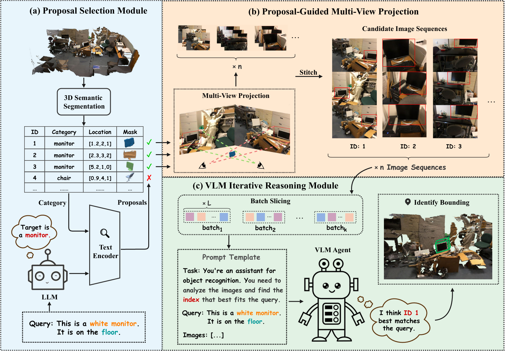

<div align="center">

# SeqVLM: Proposal-Guided Multi-View Sequences Reasoning via VLM for Zero-Shot 3D Visual Grounding

**Jiawen Lin · Shiran Bian · Yihang Zhu · Wenbin Tan · Yachao Zhang · Yuan Xie · Yanyun Qu**

### ACM Multimedia 2025

<p align="center">
    <a href='https://arxiv.org/pdf/2508.20758'>
      
    </a>
</p>

</div>

<p align="center">
  
</p>

<p align="center">
SeqVLM is a novel framework for zero-shot 3D visual grounding that leverages multi-view real-world scene images for target object reasoning. It introduces a new object-centric reasoning paradigm, starting from a potential object and verifying it via multi-view consistency, inspired by human cognition.
</p>

---

## 🔧 Installation

1.  **Clone the repository and navigate to the project directory:**
    ```bash
    git clone https://github.com/JiawLin/SeqVLM.git
    cd SeqVLM
    ```

2.  **Create and activate the Conda environment:**
    ```bash
    conda create -n SeqVLM python=3.9
    conda activate SeqVLM
    ```

3.  **Install the required dependencies:**
    ```bash
    pip install -r requirements.txt
    ```

---

## 🚀 Quick Start

### 1. Data Preparation

1.  **ScanRefer Dataset**: Download the ScanRefer dataset from the [official repository](https://github.com/daveredrum/ScanRefer) and place it under `data/scanrefer`.

2.  **Nr3D Dataset**: Download the Nr3D dataset from the [official repository](https://github.com/cshizhe/vil3dref) and place it under `data/referit3d`.

3.  **3D Features**: Generate `feats_3d.pkl` by following the instructions from [ZSVG3D](https://github.com/CurryYuan/ZSVG3D) and place the file in the `data/` directory.

4.  **Mask3D Predictions**: Download the pre-computed Mask3D predictions from [this link provided by ZSVG3D](https://github.com/CurryYuan/ZSVG3D) and place them in the appropriate data folder.

5.  **Preprocessed Image Sequences**: Download our preprocessed multi-view image sequences for [ScanRefer](url_to_scanrefer_preprocessed) and [Nr3D](https://drive.google.com/file/d/1rASHZ8YrsjrJzoaYKManMqwQB0WGp8w5/view?usp=drive_link). Unzip and place them in the `data/` directory.

6.  **(Optional) Fallback Strategy Data**: The final version of our code implements a fallback strategy using ZSVG3D when the VLM fails, which yields a slightly performance boost. If you wish to use this feature, please download the preprocessed data required by ZSVG3D:
    *   [GT Instances](https://cuhko365-my.sharepoint.com/:u:/g/personal/221019046_link_cuhk_edu_cn/Ed4HCYSQh5xDgmaCM4PatOsBWHpri34gHXePO2VwUKJWfw?e=M7vXJz)
    *   [Mask3D Predictions](https://cuhko365-my.sharepoint.com/:u:/g/personal/221019046_link_cuhk_edu_cn/EcSxmNrwwRVGsy3BhSNx5jgBjmpxPETNiKhCJCO5J_QCWw?e=C1Laoo)

    Place the downloaded files into the `data/` directory.

    > **Note:** To run the original SeqVLM without the fallback mechanism, please comment out lines 53-59 in `seqvlm/adaptive_predictor.py`.

### 2. Download Model Weights

Download the model weights for [CLIP-ViT-Base-Patch16](https://huggingface.co/openai/clip-vit-base-patch16) and, if you are using the fallback strategy, [BLIP-2-Flan-T5-XL](https://huggingface.co/Salesforce/blip2-flan-t5-xl). Place them in the `data/huggingface/` directory.

### 3. API Configuration

Set your large language model API keys and any necessary paths in the `config.yaml` file.

### 4. Evaluation

*   **To evaluate on ScanRefer:**
    ```bash
    cd seqvlm
    sh run_script.sh
    ```

*   **To evaluate on Nr3D:**
    ```bash
    cd seqvlm
    sh run_script_nr3d.sh
    ```

---

## ⚙️ Preprocessing from Scratch

If you wish to process the multi-view image sequences yourself, please run the following scripts from the `preprocess/` directory in order:

1.  `download-scannet.py`
2.  `extract_posed_image.py`
3.  `crop_2d_image.py`
4.  `stitch.py`

---

## 🙏 Acknowledgments

Our work builds upon several amazing projects. We would like to extend our gratitude to the authors of:

*   [ZSVG3D](https://github.com/CurryYuan/ZSVG3D)
*   [VLM-Grounder](https://github.com/InternRobotics/VLM-Grounder)
*   [SeeGround](https://github.com/iris0329/SeeGround)

---
